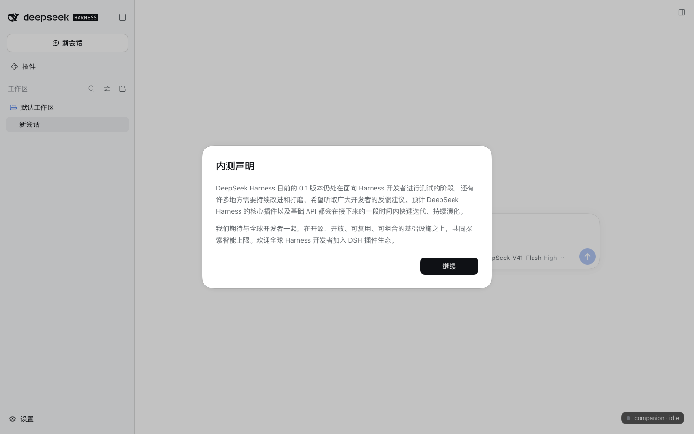
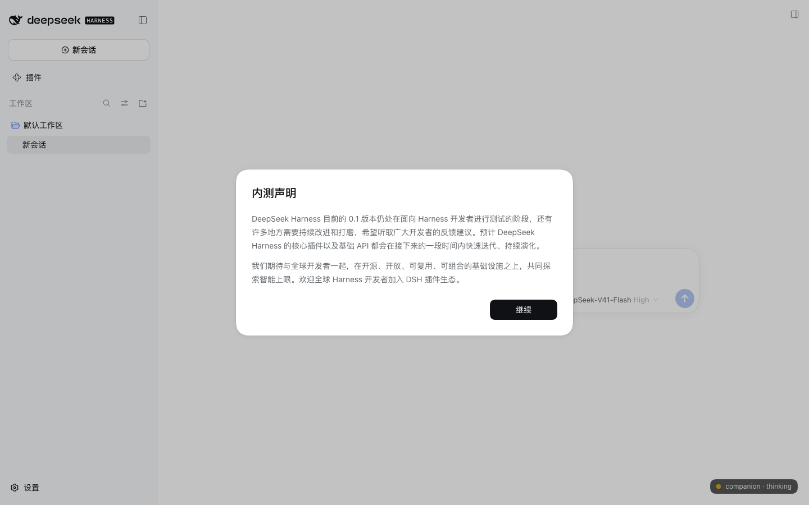

# dsh-companion-example

一个最小的 [DeepSeek Harness](https://github.com/deepseek-ai/deepseek-harness)（dsh）bundle 示例：**只用现有插件 API**，把"桌面伙伴"类插件需要的三条 seam 跑通。

它同时是 [讨论 #8044](https://github.com/deepseek-ai/deepseek-harness/discussions/8044)（桌面端窗口贡献 seam）的需求证据：先在主窗口里验证 Host Service + 事件监听 + client Slot 挂件，独立窗口形态留给后续的 shell seam。

## 演示了什么

| 需求 | 用到的 DSH seam |
| --- | --- |
| 作为 Service 被其他插件调用 | Cordis Service `ctx.companion`（`getState` / `setMood`），其他插件 `inject: ['companion']` |
| 监听事件做反应 | 全局 Cordis 事件：`session/event`（turn / step / tool 生命周期）、`agent/status`、`agent/error`，驱动 idle → thinking → working → done / error 状态机 |
| 主窗口 UI | client 插件 + `shell.overlay` Slot：右下角徽章（点击穿透层里自行 opt-in 指针事件） |
| Host ↔ Client 通道 | Typert Remote + API Gateway：`/api` 上的 `companion/getState`、`companion/setMood` |
| 安装分发 | `dsh.bundle.patch` + `cordis.patch.yml`，`dsh plugin add` 装入 profile |

## 结构

| 文件 | 作用 |
| --- | --- |
| `package.json` | 一个包同时声明 `dsh.bundle.patch`（bundle 层）与 `dsh.client`（浏览器半） |
| `cordis.patch.yml` | bundle 层：插入一行 host 插件（`name` 即包名） |
| `index.js` | Host 半：`CompanionService`（Cordis Service + Typert Remote）+ 全局事件监听 |
| `client.js` | 浏览器半：手写的 lazy-CJS factory，注册 `shell.overlay` 徽章 |
| `README.md` | 本文件 |

## 安装与运行

需要 dsh `0.1.7-rc.2`。用独立 profile 避免污染现有环境：

```sh
# 1. 从 web 模板创建一个 profile（第一次需要）
dsh --profile companion-demo --from-default-profile web

# 2. 从本地 checkout 安装（git 安装用 github:BotHarness/dsh-companion-example）
dsh plugin --profile companion-demo add /absolute/path/to/dsh-companion-example

# 3. 启动
dsh --profile companion-demo
```

打开 Web UI，主窗口右下角出现 `companion · idle` 徽章。

## 验证

1. 在任意会话发一条消息：徽章应变成 `thinking` →（有工具调用时）`working` → 回合结束后 `done`，约 4 秒后回到 `idle`。
2. 点击徽章：循环 `idle → thinking → working → done → error`，验证 client → Host 的命令通道（`companion/setMood`）。
3. 其他插件接入方式：

```js
export const inject = ['companion']

export function apply(ctx) {
  const { mood } = ctx.companion.getState()
  ctx.companion.setMood('thinking')
}
```

### 验证截图（dsh 0.1.7-rc.2，本地 web profile）

| idle | thinking（Host 改状态，客户端 2 秒内跟随） |
| --- | --- |
|  |  |

## 已知取舍

- 固定 dsh `0.1.7-rc.2`（见 `engines.dsh`）；事件名与 Typert SRC 行为都按该版本核实。
- **无构建步骤**：host 半是普通 ESM，client 半是手写的 lazy-CJS factory（dsh 客户端模块契约）。因此 `dsh plugin add github:BotHarness/dsh-companion-example` 不需要 `prepare` 构建授权。
- `@Remote` 装饰器没有构建步骤就写不进原型；`index.js` 直接写入同一份 SRC 描述符（上游 `packages/typert/protocol/src/index.ts` 的 `REMOTE_METHOD_DESCRIPTOR`）。上游提供公开 marker API 后可替换。
- 徽章每 2 秒轮询一次 `getState`（骨架的简单做法）；产品化时可换成流式 Remote 或由现有 session 事件驱动。
- bundle 的安装 / 移除需要重启 Host 生效。
- 宿主提供 `desktopWindows` 服务时（DSH 桌面 fork 基线）插件会额外打开独立窗口；标准 dsh 下只有主窗口右下角的 Slot 徽章。

## 下一步

- 用同一结构做 Live2D 产品版本（把徽章换成 Live2D canvas，`ctx.companion` 换成产品服务）。
- 独立窗口形态已实现：seam 在 fork 分支 [`BotHarness/deepseek-harness#feat/desktop-window-contribution`](https://github.com/BotHarness/deepseek-harness/tree/feat/desktop-window-contribution)；上游暂不接受外部 PR（见 [讨论 #8044](https://github.com/deepseek-ai/deepseek-harness/discussions/8044)），提交稿见 [`docs/window-seam-pr-draft.md`](./docs/window-seam-pr-draft.md)。

## License

[MIT](./LICENSE)
